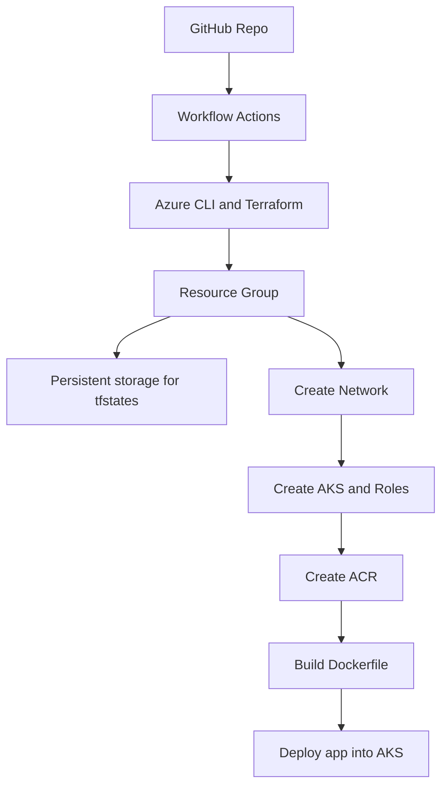

# demo-aera

TL;DR
  The repo contains a github workflow in order to spin up infra in Azure
  for a simple app to run in AKS


The worflow steps described in the following simple diagram:



For the github workflow tf actions to run, we need to setup 2 secrets.the credentials for Azure in github secrets:
1. the credentials for Azure in github secrets:
```yaml
{
  "clientId": "",
  "subscriptionId": "",
  "clientSecret": "",
  "tenantId": ""
}
```
2. the subscription ID from Azure

The credentials can be retrieved with az cli:
```shell
az ad sp create-for-rbac --name $ServiceAccount --role $Type --scopes /subscriptions/$SubsctiptionId
```
